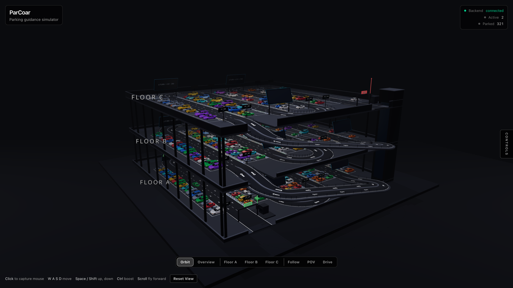
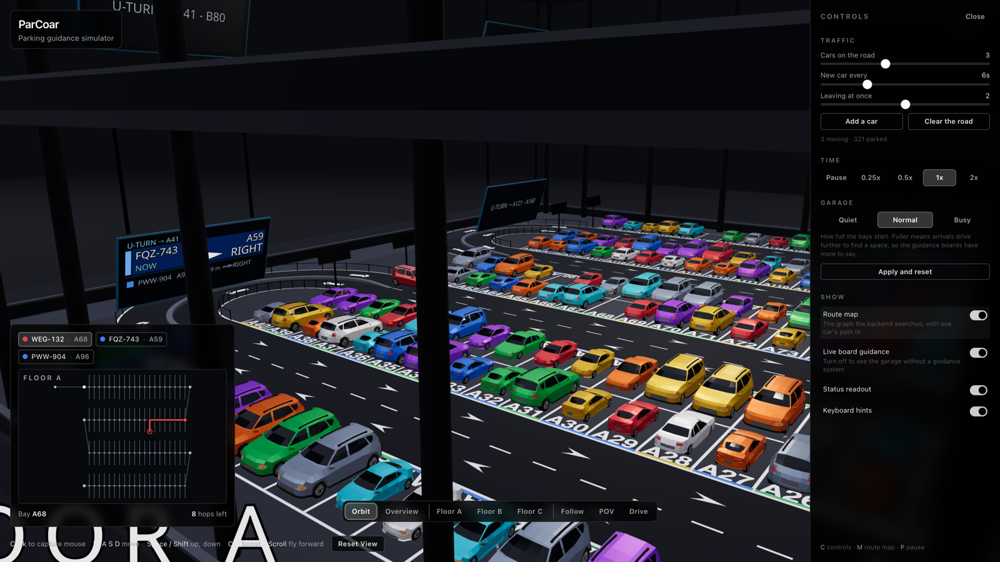

# ParCoar

A 3D multi-storey parking guidance simulator.

Cars enter a three-floor, 480-bay garage. A small Python server assigns the
closest free bay by driving distance, calculates the route, and sends it to
the browser. Overhead boards identify each car and show where to turn. You can
also inspect the route graph or drive a car yourself.



## Run it

Requirements: Python 3.11+ and Node 22+.

```bash
# Terminal 1
python3 -m venv backend/.venv
backend/.venv/bin/pip install -r backend/requirements.txt
backend/.venv/bin/python backend/server.py
```

```bash
# Terminal 2
cd frontend
npm install
npm run dev
```

Open `http://localhost:5180`.

## Controls

- **C**: controls drawer
- **M**: route map
- **P**: pause
- Camera buttons: overview, floor views, car follow, POV and drive
- Driving: **WASD**



## How it works

### Graph

`backend/generate_lot.py` creates the garage graph and writes it to:

- `shared/lot.json`
- `frontend/public/lot.json`

The graph contains 480 identical bay nodes, along with junctions, turns,
ramps, and entry, exit and approach nodes. Roads are two-way. Bays are dead
ends, so a route may finish in one or start from one, but cannot cut through
one.

Every directed edge has a distance cost. A 2.6-unit aisle step costs 2.6,
while turns and ramps use the length of the path the car follows.

### Routing

The Python server uses Dijkstra's algorithm. The first free bay finalized by
the search is the one with the shortest driving distance.

The graph has only one road route between any two locations, so congestion
routing would not change the route. The frontend still handles queues and
prevents cars from overlapping.

### State ownership

The browser simulates movement and bay sensors, then reports car positions and
occupied bays. Python:

- tracks active cars
- owns bay reservations and assignments
- calculates routes

The browser sends the current assignment after reconnecting, so a moving car
keeps its bay.

### WebSocket

The frontend sends state to `ws://127.0.0.1:8765` (override with
`VITE_WS_URL`) about five times per second. The backend replies with the
destination, route, direction, remaining route distance and estimated driving
time. See [`shared/spec.md`](shared/spec.md).

### Frontend

React, TypeScript, Three.js and React Three Fiber render the garage. Static
parked cars are instanced, repeated floor markings are baked into textures, and
shared curve generators keep roads and AI paths aligned.

The vehicle models have different visual dimensions, but those dimensions do
not affect parking allocation. All parking bays are equivalent.

## Project layout

```text
backend/     Graph generator and small WebSocket routing server
frontend/    React/TypeScript/Three.js simulator
shared/      Generated graph and WebSocket protocol
tests/       Backend tests and browser movement checks
```

## Checks

```bash
python -m unittest discover -s tests -t . -v
cd frontend && npm run build && npm test
node tests/simcheck/check.mjs   # both servers must already be running
```

## Licence

MIT. The car models are credited to Quaternius under CC0. See
`frontend/public/models/CREDITS.md` for identification details.
